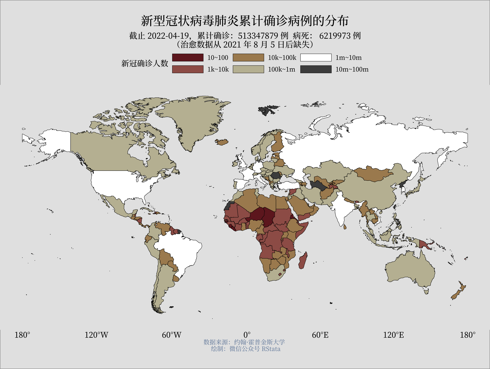
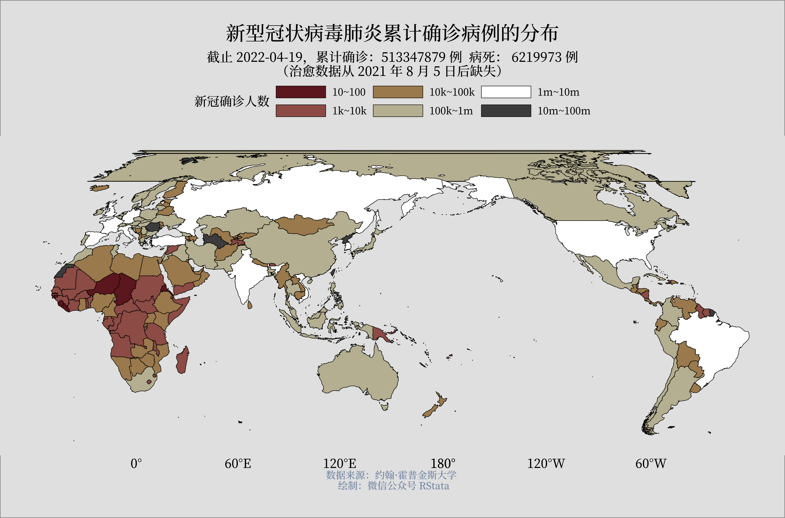
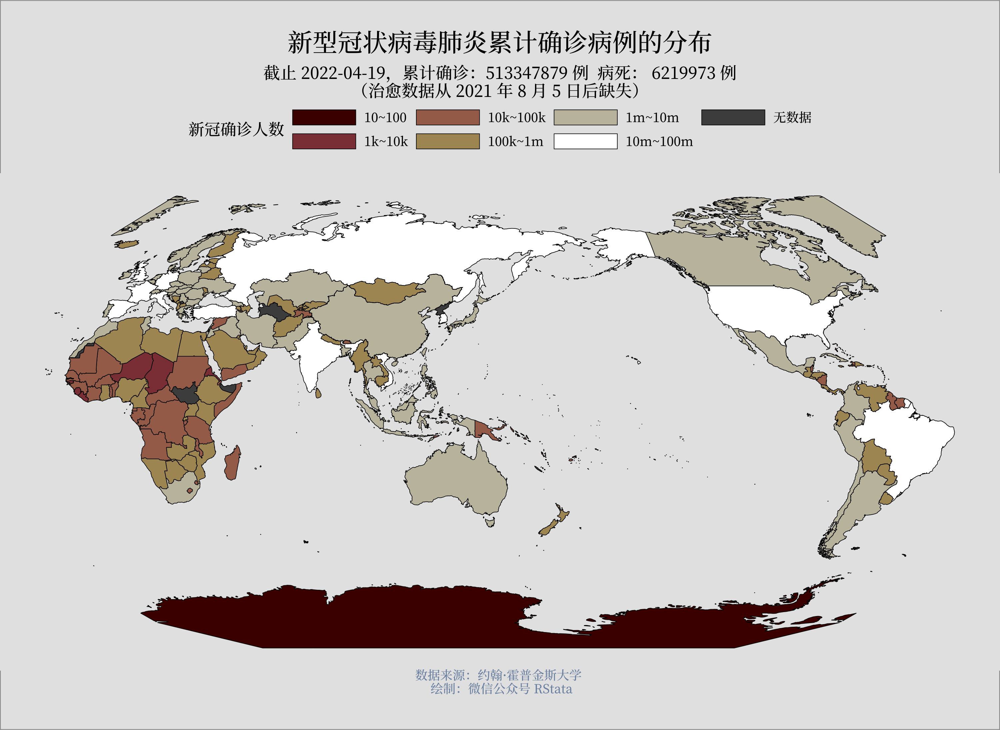
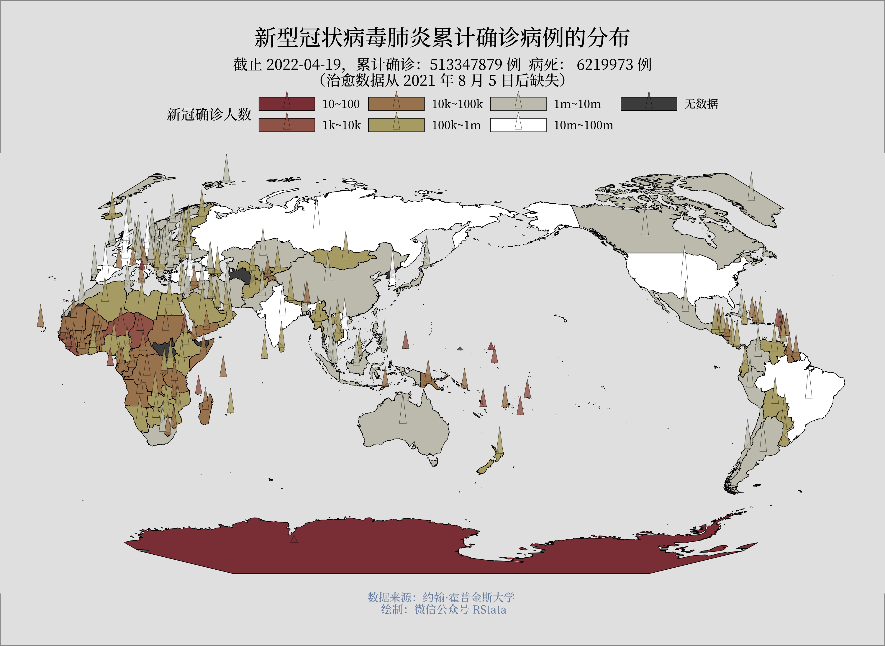

```{r setup, include=FALSE}
knitr::opts_chunk$set(echo = TRUE,
                      dpi = 400,
                      warning = FALSE,
                      message = FALSE,
                      # out.width = "100%",
                      # out.height = "500px",
                      fig.align = 'center',
                      attr.output = ".comment",
                      fig.width = 10,
                      fig.height = 8,
                      comment = "#>")
```

通常在之前的课程中我们绘制的世界地图是这样的：

```{r}
# 之前的地图
library(sf)
library(tidyverse)
read_sf("world_high_resolution_mill.geo.json") -> wdmp
readxl::read_xlsx("world-covid19.xlsx") -> df
df %>% 
  mutate(date = as.Date(date)) %>% 
  dplyr::filter(date == "2022-04-20") %>% 
  select(iso, confirmed) -> df

wdmp %>% 
  left_join(df,  by = c("code" = "iso")) -> mapdf

range(mapdf$confirmed, na.rm = T)

source("theme_gray.R") 

mapdf %>% 
  mutate(group = cut(confirmed, 
                     breaks = 10^(0:8))) %>% 
  ggplot() + 
  geom_sf(aes(fill = group), linewidth = 0.2, 
          color = "black") + 
  scico::scale_fill_scico_d(
    palette = "bilbao", na.value = "grey30", begin = 0.1,
    name = "新冠确诊人数", 
    labels = c("10~100", "1k~10k",
               "10k~100k", "100k~1m", "1m~10m",
               "10m~100m", "无数据")
  ) + 
  labs(title = "新型冠状病毒肺炎累计确诊病例的分布",
       subtitle = "截止 2022-04-19，累计确诊：513347879 例  病死： 6219973 例\n（治愈数据从 2021 年 8 月 5 日后缺失）",
       caption = "数据来源：约翰·霍普金斯大学 \n 绘制：微信公众号 RStata") -> map0

ggsave("map0.png", device = png, width = 10, height = 8)
knitr::plot_crop("map0.png") 
```



而我们经常看到的地图印刷品上的世界地图是这样的：


理论上来说，我们只要更改下 crs 就可以绘制这种太平洋在中间的地图了，例如使用 “+proj=eck3 +lat_ts=0 +lat_0=0 +lon_0=150 +x_0=0 +y_0=0 +datum=WGS84 +units=m +no_defs”：

```{r}
# 如果强行更改 crs：
mapdf %>% 
  mutate(group = cut(confirmed, 
                     breaks = 10^(0:8))) %>% 
  ggplot() + 
  geom_sf(aes(fill = group), linewidth = 0.2, 
          color = "black") + 
  scico::scale_fill_scico_d(
    palette = "bilbao", na.value = "grey30", begin = 0.1,
    name = "新冠确诊人数", 
    labels = c("10~100", "1k~10k",
               "10k~100k", "100k~1m", "1m~10m",
               "10m~100m", "无数据")
  ) + 
  labs(title = "新型冠状病毒肺炎累计确诊病例的分布",
       subtitle = "截止 2022-04-19，累计确诊：513347879 例  病死： 6219973 例\n（治愈数据从 2021 年 8 月 5 日后缺失）",
       caption = "数据来源：约翰·霍普金斯大学 \n 绘制：微信公众号 RStata") +
  coord_sf(crs = "+proj=eck3 +lat_ts=0 +lat_0=0 +lon_0=150 +x_0=0 +y_0=0 +datum=WGS84 +units=m +no_defs") -> maperror

ggsave("maperror.png", device = png, width = 10, height = 8)
knitr::plot_crop("maperror.png") 
```



结果图上出现了乱七八糟的区域，这是因为格林兰岛本来是一个多边形，但是更改 crs 后被分成了两部分绘制，但是数据又决定了它不能分成两部分，于是就出现了上图的效果，所以解决方法也就是要先把这些由于 crs 改变产生的问题解决了，也就是把格林兰岛岛还有其他可能会被撕扯开的区域预先切成两部分。

我们通常使用的世界地图矢量数据多半是从国外下载的，但是这些数据里面的中国区域并不准确，因此我们需要根据中国的境界进行调整。下面我们演示下如何在 R 语言中进行调整。

例如 rnaturalearthdata 包就有一个世界地图的数据，不过是个 sp 对象，我们可以使用 st_as_sf() 把它转换成 sf 对象。

```{r}
rnaturalearthdata::countries50 %>% 
  st_as_sf() -> worldMap 
```

这个 worldMap 包含了很多变量，我们选择几个需要的：

```{r}
worldMap %>% 
  select(country = admin, continent, 
         iso3 = adm0_a3) %>% 
  as_tibble() %>% 
  st_sf() %>% 
  st_transform(4326) -> worldMap
worldMap
```

但是这个地图数据是有问题的，下面我们针对中国部分进行修正。

首先准备一份没有问题的中国地图：

```{r}
read_sf("2021行政区划/省.shp") %>% 
  st_union() %>% 
  nngeo::st_remove_holes() -> cn
```

`nngeo::st_remove_holes()` 可以用于去除多边形内部的空洞。

然后把 cn 数据改成类似 worldMap 的数据：

```{r}
read_sf("2021行政区划/九段线.shp") -> jdx
cn %>% 
  st_sf() %>% 
  mutate(country = "China",
         continent = "Asia",
         iso3 = "CHN") -> cn

# 把中国地图数据简化下
cn %>% 
  st_simplify(dTolerance = 2000) -> cn
```

然后我们把世界地图数据中和 cn 相交的都去除：

```{r}
worldMap %>% 
  st_make_valid() %>% 
  st_difference(cn) %>% 
  dplyr::filter(!country %in% c("China", "Hong Kong S.A.R.", "Macao S.A.R")) -> worldMap
```

然后再把正确的中国数据添加上去：

```{r}
worldMap %>% 
  add_row(cn) %>% 
  arrange(country) -> worldMap
```

这样我们就得到了一幅符合国内要求的世界地图数据了，然后我们再调整下地图的中心。

假如我们想要得到 "+proj=eck3 +lat_ts=0 +lat_0=0 +lon_0=150 +x_0=0 +y_0=0 +datum=WGS84 +units=m +no_defs" 坐标系下的世界地图数据，我们可以生成一个狭长的多边形对上面得到的数据进行裁剪：

```{r}
# 调整为太平洋为中心
target_crs <- st_crs("+proj=eck3 +lat_ts=0 +lat_0=0 +lon_0=150 +x_0=0 +y_0=0 +datum=WGS84 +units=m +no_defs")

# 生成一个细长的多边形
offset <- 180 - 150 

polygon <- st_polygon(x = list(rbind(
  c(-0.0001 - offset, 90),
  c(0 - offset, 90),
  c(0 - offset, -90),
  c(-0.0001 - offset, -90),
  c(-0.0001 - offset, 90)
))) %>%
  st_sfc() %>%
  st_sf() %>% 
  st_set_crs(4326)

plot(polygon)
plot(worldMap["country"], add = T)
```

从世界地图上删除和这个狭长多边形重合的部分：

```{r}
worldMap %>% 
  st_make_valid() %>% 
  st_transform(4326) %>% 
  st_difference(polygon) -> world2
```

转换坐标系：

```{r}
world2 %>% 
  st_transform(crs = target_crs) -> world3

# 绘图示意
ggplot(data = world3, aes(group = iso3)) +
  geom_sf(fill = "grey") + 
  coord_sf(crs = target_crs)
```

最后我们把处理结果保存为 shp 格式的数据：

```{r}
dir.create("worldmap")
world3 %>% 
  st_make_valid() %>% 
  st_write("worldmap/worldmap.shp", layer_options = "ENCODING=UTF-8", delete_layer = TRUE, layer = "MULTIPOLYGON") 
```

保存九段线数据：

```{r}
dir.create("jdx")
jdx %>% 
  st_transform(target_crs) %>% 
  st_make_valid() %>% 
  st_collection_extract("LINESTRING") %>% 
  st_write("jdx/jdx.shp", layer_options = "ENCODING=UTF-8", delete_layer = TRUE, layer = "MULTILINESTRING") 
```

最后我们再使用这个数据绘图展示疫情数据：

```{r}
readxl::read_xlsx("world-covid19.xlsx") -> df
df %>% 
  mutate(date = as.Date(date)) %>% 
  dplyr::filter(date == "2022-04-20") %>% 
  select(iso, confirmed) -> df
  
world3 %>% 
  left_join(df,  by = c("iso3" = "iso")) -> mapdf

range(mapdf$confirmed, na.rm = T)

source("theme_gray.R")

mapdf %>% 
  mutate(group = cut(confirmed, 
                     breaks = 10^(0:8))) %>% 
  ggplot() + 
  geom_sf(aes(fill = group), linewidth = 0.2, 
          color = "black") + 
  geom_sf(data = jdx, color = "black", 
          linewidth = 0.2) +  
  scico::scale_fill_scico_d(
    palette = "bilbao", na.value = "grey30", 
    name = "新冠确诊人数", 
    labels = c("10~100", "1k~10k",
               "10k~100k", "100k~1m", "1m~10m",
               "10m~100m", "无数据")
  ) + 
  labs(title = "新型冠状病毒肺炎累计确诊病例的分布",
       subtitle = "截止 2022-04-19，累计确诊：513347879 例  病死： 6219973 例\n（治愈数据从 2021 年 8 月 5 日后缺失）",
       caption = "数据来源：约翰·霍普金斯大学 \n 绘制：微信公众号 RStata") -> map

ggsave("map.png", device = png, width = 10, height = 8)
knitr::plot_crop("map.png") 
```



还可以使用 ggtriangles 包（附件中有这个包的离线安装包）在地图上添加不同高度的三角形来表示各国的新增确诊人数：

```{r}
# 安装：devtools::install_local("ggtriangles")
mapdf %>% 
  st_point_on_surface() %>% 
  st_coordinates() %>% 
  as_tibble() -> point

library(ggtriangles)
mapdf %>% 
  mutate(group = cut(confirmed, 
                     breaks = 10^(0:8))) %>% 
  mutate(x = point$X, y = point$Y) %>% 
  ggplot() + 
  geom_sf(aes(fill = group), linewidth = 0.2, 
          color = "black") + 
  geom_sf(data = jdx, color = "black", 
          linewidth = 0.2) + 
  geom_triangles(aes(x, y, 
                     triangle_height = confirmed,
                     fill = group), 
                 triangle_width = 0.2,
                 colo = "gray30", size = 0.1,
                 alpha = 0.8) + 
  scale_triangle_height(trans = "log10") + 
  guides(triangle_height = "none") + 
  scico::scale_fill_scico_d(
    palette = "bilbao", na.value = "grey30", 
    name = "新冠确诊人数", begin = 0.2,
    labels = c("10~100", "1k~10k",
               "10k~100k", "100k~1m", "1m~10m",
               "10m~100m", "无数据")
  ) + 
  labs(title = "新型冠状病毒肺炎累计确诊病例的分布",
       subtitle = "截止 2022-04-19，累计确诊：513347879 例  病死： 6219973 例\n（治愈数据从 2021 年 8 月 5 日后缺失）",
       caption = "数据来源：约翰·霍普金斯大学 \n 绘制：微信公众号 RStata") + 
  theme(axis.title.x = element_blank(),
        axis.title.y = element_blank()) -> map2

ggsave("map2.png", device = png, width = 10, height = 8)
knitr::plot_crop("map2.png") 
```


